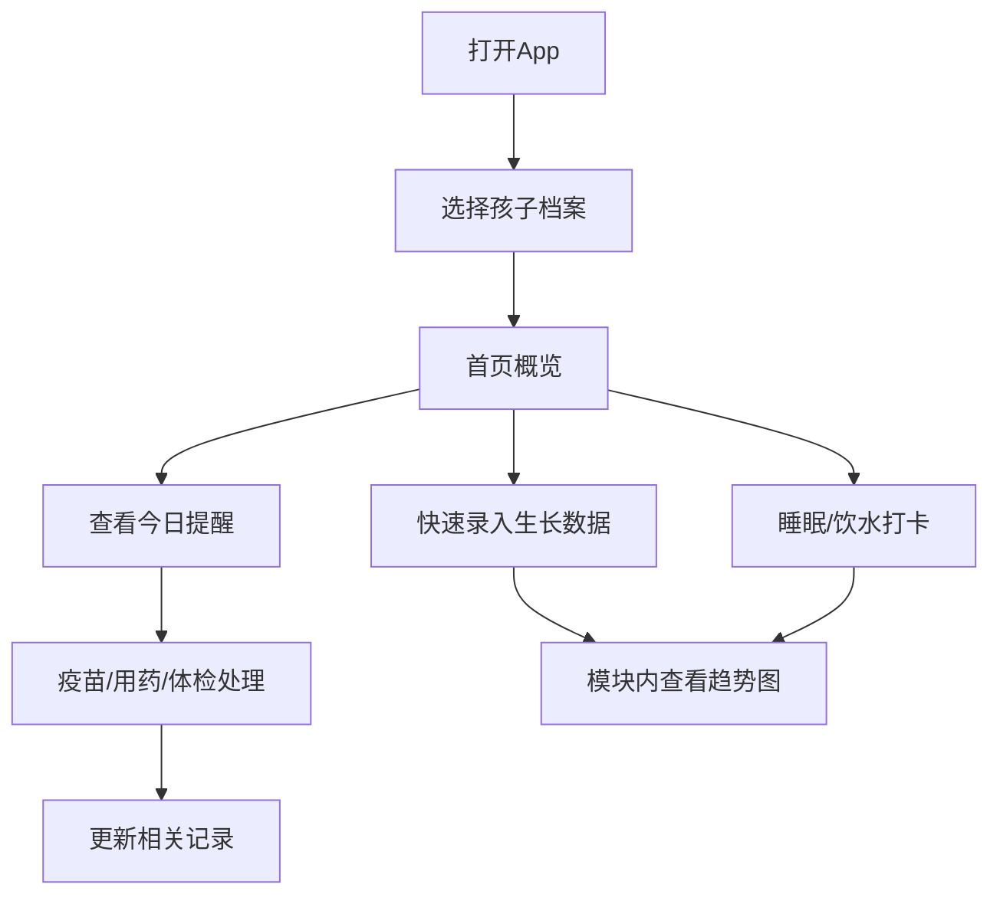
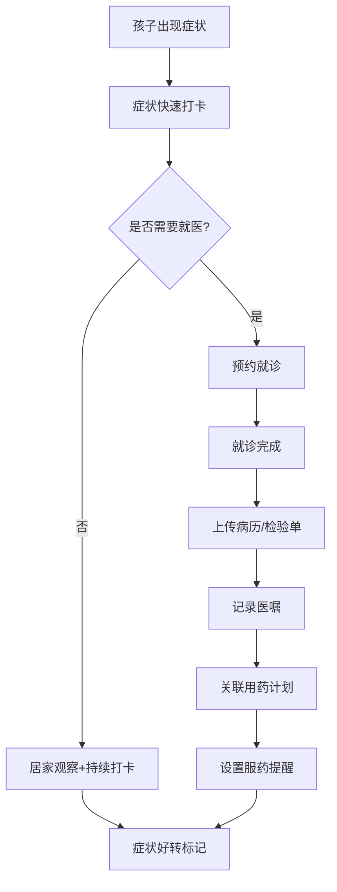

## 1. 产品概述

童康记 - 儿童健康移动管理平台，为0-12岁儿童家长提供全方位的日常健康记录与管理服务。通过系统化的健康数据追踪、智能提醒和专业就医辅助，帮助家长科学守护孩子成长。

- 核心目标：解决家长记录孩子健康数据分散、疫苗接种容易遗忘、就诊资料保管混乱等痛点
- 市场价值：覆盖亿万家庭的儿童健康管理需求，建立从日常记录到专业就医的完整健康生态

## 2. 核心功能

### 2.1 用户角色

| 角色 | 注册方式 | 核心权限 |
|------|----------|----------|
| 主账号（家长） | 手机号注册 | 完整功能使用、管理孩子档案、授权照护人 |
| 照护人 | 邀请链接注册 | 查看被授权的孩子健康数据、记录日常数据 |

### 2.2 功能模块

1. **首页**：孩子档案切换、身高体重概览、睡眠记录、饮水打卡、今日提醒事项
2. **成长记录**：体检数据录入、牙齿发育记录、视力检测追踪、过敏史管理、成长趋势可视化图表
3. **疫苗管理**：国家免疫规划接种计划查看、接种预约、补种提醒、留观30分钟记录
4. **用药记录**：药品信息录入、剂量/时间/疗程管理、服药提醒、不良反应记录
5. **症状打卡**：发热/咳嗽/腹泻快速记录、症状严重程度标记、持续时间追踪
6. **就诊档案**：病历拍照保存、检验单图片归档、医嘱文字记录、就诊时间线
7. **家庭中心**：多孩子档案管理、照护人授权、健康数据导出（供医生查阅）

### 2.3 页面详情

| 页面名称 | 模块名称 | 功能描述 |
|---------|----------|---------|
| 首页 | 档案切换卡 | 显示孩子头像/姓名/年龄，支持多孩子切换 |
| 首页 | 生长指标卡 | 最新身高体重数据+百分位参考+快速录入 |
| 首页 | 睡眠记录卡 | 今日睡眠时长+入睡/起床时间+快速打卡 |
| 首页 | 饮水记录卡 | 今日饮水量进度条+次数统计+一键加水 |
| 首页 | 今日提醒区 | 疫苗/用药/体检等提醒事项列表 |
| 成长记录 | Tab导航 | 体检/牙齿/视力/过敏四个分类切换 |
| 成长记录 | 数据录入表 | 各项指标表单录入+日期选择 |
| 成长记录 | 趋势图表 | 身高/体重/BMI随年龄变化的折线图 |
| 成长记录 | 记录列表 | 历史记录按时间倒序展示+编辑删除 |
| 疫苗管理 | 接种时间表 | 按年龄列出所有计划疫苗+状态标记 |
| 疫苗管理 | 预约功能 | 选择接种点+日期时间+确认预约 |
| 疫苗管理 | 补种提醒 | 超期未接种疫苗高亮+一键提醒设置 |
| 疫苗管理 | 留观记录 | 接种后30分钟倒计时+不良反应记录 |
| 用药记录 | 用药列表 | 当前用药+历史用药分组展示 |
| 用药记录 | 药品录入 | 药名/剂量/频次/疗程/起止时间 |
| 用药记录 | 服药提醒 | 按计划时间推送提醒+打卡确认 |
| 用药记录 | 不良反应 | 症状描述+发生时间+处理方式记录 |
| 症状打卡 | 快速入口 | 发热/咳嗽/腹泻三大症状大按钮 |
| 症状打卡 | 详情录入 | 体温值/咳嗽频率/腹泻次数+备注 |
| 症状打卡 | 时间线 | 症状持续时间+变化趋势展示 |
| 就诊档案 | 就诊列表 | 按日期展示所有就诊记录卡片 |
| 就诊档案 | 资料上传 | 病历/检验单图片上传+OCR识别（模拟） |
| 就诊档案 | 医嘱记录 | 诊断结论+用药指导+复诊提醒文字录入 |
| 家庭中心 | 孩子管理 | 添加/编辑/删除孩子档案 |
| 家庭中心 | 照护人管理 | 邀请/移除照护人+权限设置 |
| 家庭中心 | 数据导出 | 选择时间范围+导出PDF/分享给医生 |

## 3. 核心流程

### 3.1 日常健康记录流程

家长打开App → 选择孩子档案 → 从首页快速录入身高体重/睡眠/饮水 → 查看今日提醒并处理 → 切换到各模块查看详细数据和趋势

### 3.2 就诊与资料归档流程

孩子生病 → 症状打卡记录 → 预约就医 → 就诊后上传病历和检验单 → 记录医嘱 → 关联用药记录 → 持续追踪康复情况

## 4. 用户界面设计

### 4.1 设计风格

- **主色调**：温和薄荷绿 `#4ECDC4`（健康、清新），搭配珊瑚粉 `#FF6B6B`（警示、关爱）
- **辅助色**：天空蓝 `#45B7D1`（信任）、柠檬黄 `#FFE66D`（活力）、薰衣草紫 `#C7B8EA`（柔和）
- **中性色**：暖白 `#FFFBF5` 背景、深灰 `#2D3436` 主文字、中灰 `#636E72` 辅助文字
- **按钮风格**：全圆角胶囊按钮（radius-999），主按钮渐变色，点击有微弹动效
- **卡片风格**：大圆角（radius-24）、柔和阴影、微悬浮效果，背景使用渐变或浅暖色
- **字体选择**：
  - 标题：圆润可爱的 display 字体，大号加粗
  - 正文：清晰易读的无衬线字体，中号常规
  - 数据数字：等宽字体，突出显示
- **布局风格**：底部 Tab 导航 + 顶部标题栏，卡片瀑布流布局，大量留白
- **图标风格**：Lucide 图标 + 彩色圆角背景徽章，关键数据使用大号 emoji 增加亲和力

### 4.2 页面设计概览

| 页面名称 | 模块名称 | UI 元素与风格 |
|---------|----------|---------------|
| 首页 | 整体布局 | 顶部渐变弧形背景 + 孩子头像卡片 + 4张功能卡（2x2网格）+ 提醒列表，页面加载时有从上到下的卡片错峰入场动画 |
| 首页 | 数据卡片 | 每张卡片左上图标徽章 + 主数据大字 + 辅助小字说明 + 右下快捷操作按钮，悬停时轻微上浮+阴影加深 |
| 成长记录 | 趋势图区 | 顶部大尺寸折线图（渐变填充区域），支持双指缩放，数据点点击显示详情气泡 |
| 成长记录 | 录入表单 | 底部弹出式 BottomSheet，毛玻璃背景，表单字段分组+图标前缀 |
| 疫苗管理 | 时间轴 | 垂直时间轴设计，左侧年龄段，右侧疫苗卡片，已接种/未接种/逾期三色状态 |
| 用药记录 | 服药卡片 | 圆形药品图标 + 药名 + 下一次服药倒计时圆环进度条 |
| 症状打卡 | 快速入口 | 三个大号圆形按钮，发热红色、咳嗽蓝色、腹泻橙色，点击后波纹扩散效果 |
| 就诊档案 | 资料卡片 | 图片缩略图网格，点击全屏查看，支持左右滑动切换 |
| 家庭中心 | 头像组 | 照护人头像叠加展示，点击展开权限设置面板 |

### 4.3 响应式设计

- **移动端优先**：以 iPhone 14/15（390×844）为基准设计，完美适配主流手机尺寸
- **平板适配**：在 ≥768px 宽度下，首页卡片采用 3 列布局，图表区域扩大展示
- **触控优化**：所有可点击元素最小 44×44px 触控区域，按钮间距 ≥12px
- **安全区域**：顶部避开刘海/灵动岛，底部避开 Home Indicator

### 4.4 动画与动效

- 页面切换：左右滑动过渡（300ms ease-out）
- 卡片入场：错开的 translateY + fade-in（每张间隔 80ms）
- 数据更新：数字滚动动画（count-up effect）
- 按钮点击：scale(0.96) + 恢复（150ms）
- 底部导航切换：图标跳动 + 指示条滑动
- 进度条填充：从左到右线性渐变动画
