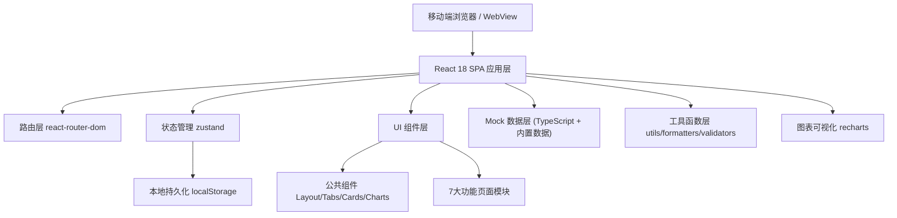
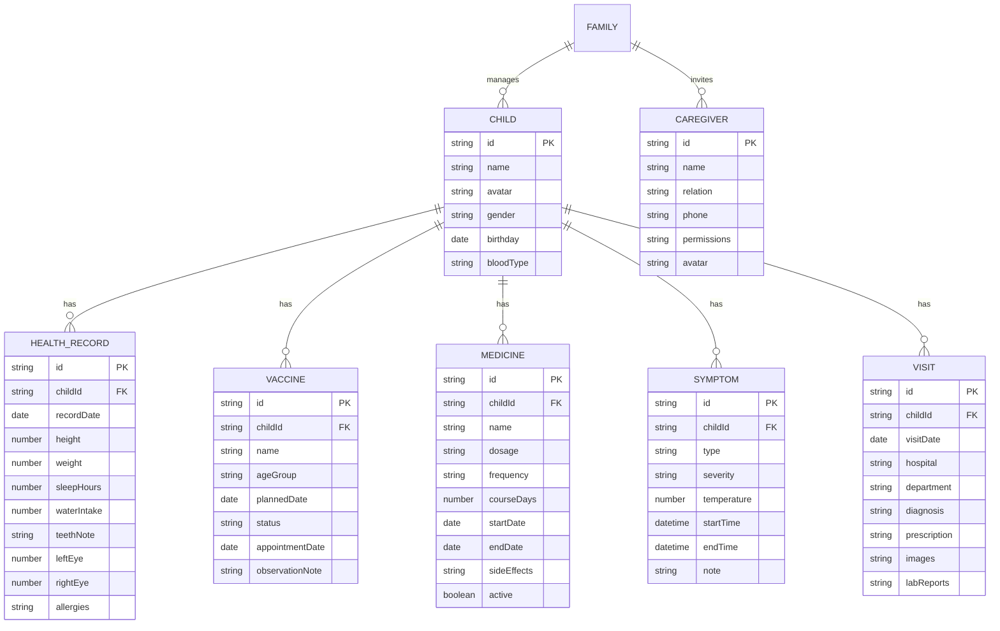

## 1. 架构设计



**设计原则**：纯前端 SPA 架构，无需后端服务，所有数据通过 localStorage 本地持久化，内置丰富的 Mock 数据用于演示，确保移动端流畅体验。

## 2. 技术栈说明

- **前端框架**：React 18.3 + TypeScript 5.x
- **构建工具**：Vite 5.x（极速开发体验，HMR）
- **路由管理**：react-router-dom 6.x（Hash 路由，移动端适配）
- **状态管理**：zustand 4.x（轻量、简洁、支持持久化中间件）
- **样式方案**：TailwindCSS 3.x（原子化 CSS，自定义主题色）
- **UI 图标**：lucide-react（高质量开源图标库）
- **图表可视化**：recharts 2.x（React 图表库，面积图/折线图）
- **数据持久化**：localStorage + zustand persist 中间件
- **日期处理**：原生 Intl API + 自定义 date-fns 风格工具函数

## 3. 路由定义

| 路由路径 | 页面组件 | 功能说明 |
|---------|----------|---------|
| `/` | HomePage | 首页：身高体重、睡眠、饮水、今日提醒 |
| `/growth` | GrowthPage | 成长记录：体检/牙齿/视力/过敏 + 趋势图 |
| `/vaccine` | VaccinePage | 疫苗管理：接种计划/预约/补种/留观 |
| `/medicine` | MedicinePage | 用药记录：剂量/时间/疗程/不良反应 |
| `/symptom` | SymptomPage | 症状打卡：发热/咳嗽/腹泻快速记录 |
| `/visit` | VisitPage | 就诊档案：病历/检验单/医嘱 |
| `/family` | FamilyPage | 家庭中心：照护人/导出医生 |

## 4. 状态管理设计

### 4.1 Zustand Store 结构

```typescript
// src/store/useHealthStore.ts

interface ChildProfile {
  id: string;
  name: string;
  avatar: string;
  gender: 'male' | 'female';
  birthday: string;
  bloodType?: string;
}

interface HealthRecord {
  // 生长记录
  height?: number;
  weight?: number;
  bmi?: number;
  headCircumference?: number;
  // 睡眠
  sleepStart?: string;
  sleepEnd?: string;
  sleepDuration?: number;
  // 饮水
  waterIntake?: number;
  waterGoal?: number;
  // 牙齿/视力
  teethNote?: string;
  leftEye?: number;
  rightEye?: number;
  // 过敏史
  allergies?: string[];
  recordDate: string;
}

interface VaccineRecord {
  id: string;
  name: string;
  ageGroup: string;
  plannedDate: string;
  status: 'pending' | 'completed' | 'overdue' | 'scheduled';
  appointmentDate?: string;
  observationNote?: string;
  observationEndTime?: string;
}

interface MedicineRecord {
  id: string;
  name: string;
  dosage: string;
  frequency: string;
  courseDays: number;
  startDate: string;
  endDate: string;
  timesPerDay: string[];
  sideEffects?: string;
  active: boolean;
}

interface SymptomRecord {
  id: string;
  type: 'fever' | 'cough' | 'diarrhea';
  severity: 'mild' | 'moderate' | 'severe';
  temperature?: number;
  frequency?: number;
  note?: string;
  startTime: string;
  endTime?: string;
}

interface VisitRecord {
  id: string;
  visitDate: string;
  hospital: string;
  department: string;
  doctor?: string;
  diagnosis: string;
  prescription: string;
  nextVisit?: string;
  images: string[];
  labReports: string[];
}

interface Caregiver {
  id: string;
  name: string;
  relation: string;
  phone: string;
  permissions: string[];
  avatar?: string;
}

interface HealthStore {
  // 状态
  currentChildId: string;
  children: ChildProfile[];
  healthRecords: Record<string, HealthRecord[]>;
  vaccines: Record<string, VaccineRecord[]>;
  medicines: Record<string, MedicineRecord[]>;
  symptoms: Record<string, SymptomRecord[]>;
  visits: Record<string, VisitRecord[]>;
  caregivers: Caregiver[];
  reminders: Reminder[];
  
  // Actions
  setCurrentChild: (id: string) => void;
  addChild: (child: Omit<ChildProfile, 'id'>) => void;
  addHealthRecord: (childId: string, record: Omit<HealthRecord, 'id'>) => void;
  addVaccine: (childId: string, vaccine: VaccineRecord) => void;
  updateVaccineStatus: (childId: string, vaccineId: string, status: VaccineRecord['status']) => void;
  addMedicine: (childId: string, medicine: Omit<MedicineRecord, 'id'>) => void;
  addSymptom: (childId: string, symptom: Omit<SymptomRecord, 'id'>) => void;
  addVisit: (childId: string, visit: Omit<VisitRecord, 'id'>) => void;
  addCaregiver: (caregiver: Omit<Caregiver, 'id'>) => void;
  removeCaregiver: (id: string) => void;
}
```

## 5. 数据模型定义

### 5.1 ER 关系图



## 6. 项目目录结构

```
src/
├── assets/              # 静态资源（图片、emoji、默认头像）
├── components/          # 公共可复用组件
│   ├── layout/          # 布局组件
│   │   ├── AppLayout.tsx      # 全局布局（底部导航+顶部栏）
│   │   ├── BottomNav.tsx      # 底部 Tab 导航栏
│   │   └── PageHeader.tsx     # 页面顶部标题栏
│   ├── ui/              # UI 基础组件
│   │   ├── Card.tsx           # 通用卡片容器
│   │   ├── StatCard.tsx       # 数据统计卡片
│   │   ├── Button.tsx         # 胶囊按钮
│   │   ├── ProgressBar.tsx    # 渐变进度条
│   │   ├── Avatar.tsx         # 头像组件
│   │   ├── Badge.tsx          # 状态徽章
│   │   ├── EmptyState.tsx     # 空状态提示
│   │   └── ModalSheet.tsx     # 底部弹出面板
│   ├── charts/          # 图表组件
│   │   ├── GrowthChart.tsx    # 身高体重趋势图
│   │   └── SleepChart.tsx     # 睡眠趋势图
│   └── forms/           # 表单组件
│       ├── FormInput.tsx      # 表单输入框
│       ├── FormSelect.tsx     # 下拉选择
│       └── FormDatePicker.tsx # 日期选择器
├── pages/               # 7个功能页面
│   ├── HomePage.tsx
│   ├── GrowthPage.tsx
│   ├── VaccinePage.tsx
│   ├── MedicinePage.tsx
│   ├── SymptomPage.tsx
│   ├── VisitPage.tsx
│   └── FamilyPage.tsx
├── store/               # zustand 状态管理
│   ├── useHealthStore.ts      # 主健康数据 store
│   └── mockData.ts            # 初始化 Mock 数据
├── hooks/               # 自定义 hooks
│   ├── useCountUp.ts          # 数字滚动动画
│   ├── useLocalTime.ts        # 本地时间格式化
│   └── useReminder.ts         # 提醒事项计算
├── utils/               # 工具函数
│   ├── dateUtils.ts           # 日期计算（年龄、天数差）
│   ├── formatters.ts          # 数字、单位格式化
│   ├── validators.ts          # 表单验证
│   ├── exportData.ts          # 数据导出为 JSON/PDF 文本
│   └── constants.ts           # 常量（疫苗表、权限表等）
├── types/               # TypeScript 类型定义
│   └── index.ts               # 所有接口类型集中导出
├── App.tsx              # 路由配置 + Store Provider
├── main.tsx             # 入口文件
└── index.css            # Tailwind 引入 + 全局样式 + 动画
```

## 7. 性能与体验优化

1. **首屏加载优化**：Vite 代码分割 + 路由懒加载（非首页延迟加载）
2. **动画性能**：所有动画使用 CSS transform/opacity，避免触发重排
3. **长列表优化**：历史记录使用虚拟滚动 + 分页加载（超过 50 条时分页）
4. **图片优化**：就诊资料图片使用 WebP 格式，懒加载 + 压缩存储
5. **离线可用**：Service Worker 缓存静态资源，数据 localStorage 持久化
6. **手势支持**：图表支持双指缩放、页面支持下拉刷新（视觉反馈）

## 8. 颜色与主题配置（Tailwind 扩展）

```javascript
// tailwind.config.js
{
  theme: {
    extend: {
      colors: {
        mint: {
          50: '#F0FDFA', 100: '#CCFBF1', 200: '#99F6E4',
          300: '#5EEAD4', 400: '#2DD4BF', 500: '#4ECDC4',
          600: '#0D9488', 700: '#0F766E'
        },
        coral: {
          400: '#FF8A80', 500: '#FF6B6B', 600: '#FF5252'
        },
        sky2: {
          400: '#64C2E3', 500: '#45B7D1', 600: '#2FA4BF'
        },
        lemon: {
          400: '#FFED85', 500: '#FFE66D', 600: '#FFD93D'
        },
        lavender: {
          300: '#D9CCF4', 400: '#C7B8EA', 500: '#B39DDB'
        },
        warm: {
          50: '#FFFBF5', 100: '#FFF8EC'
        }
      },
      fontFamily: {
        display: ['"Quicksand"', '"PingFang SC"', 'sans-serif'],
        body: ['"Nunito"', '"PingFang SC"', 'sans-serif'],
        mono: ['"JetBrains Mono"', 'monospace']
      },
      borderRadius: {
        '4xl': '2rem',
        '5xl': '2.5rem'
      },
      boxShadow: {
        soft: '0 10px 40px -10px rgba(0,0,0,0.08)',
        glow: '0 0 30px rgba(78, 205, 196, 0.3)'
      },
      animation: {
        'bounce-soft': 'bounce-soft 2s infinite',
        'float': 'float 3s ease-in-out infinite',
        'pulse-ring': 'pulse-ring 1.5s cubic-bezier(0.24, 0, 0.38, 1) infinite',
        'slide-up': 'slide-up 0.3s ease-out',
        'fade-in': 'fade-in 0.4s ease-out'
      }
    }
  }
}
```
